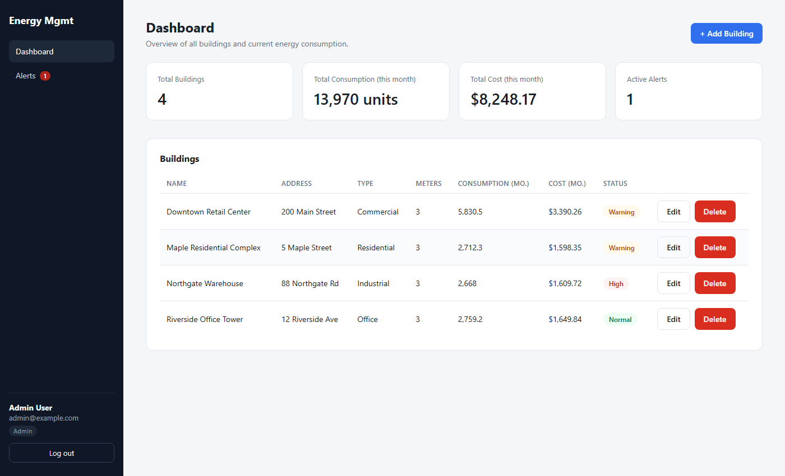
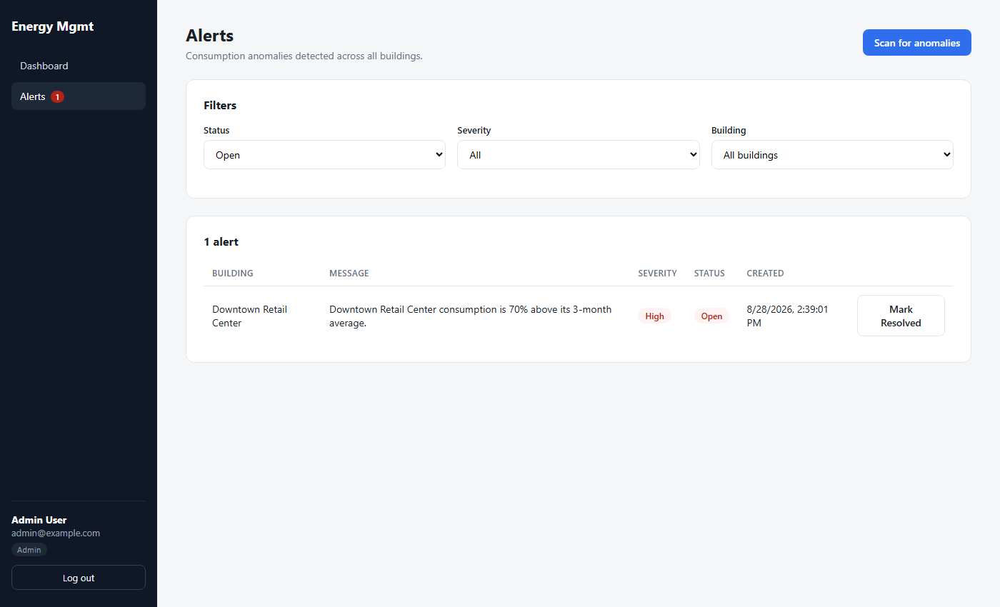

# Energy Management System

A full-stack building energy management app: track buildings, meters, and consumption
readings; monitor cost and status on a dashboard; and get automatic alerts when a
building's consumption looks anomalous.

## Screenshots

**Dashboard** — summary cards and per-building status at a glance:



**Alerts** — anomalies detected automatically from consumption history:



## Architecture overview

The backend follows a simple Clean Architecture layering:

```
backend/
  src/
    EnergyManagement.Core            entities & enums (Building, Meter, Reading, Alert, ...)
    EnergyManagement.Application     DTOs + service interfaces (no EF Core dependency)
    EnergyManagement.Infrastructure  EF Core DbContext, migrations, service implementations
    EnergyManagement.Api             ASP.NET Core controllers, auth, DI wiring
  tests/
    EnergyManagement.Tests           xUnit tests for the Infrastructure services
```

`Core` and `Application` have no knowledge of EF Core or ASP.NET Identity — they define
entities, DTOs, and interfaces. `Infrastructure` implements those interfaces against a
SQLite database via EF Core. `Api` only wires up DI and exposes HTTP endpoints; the actual
business logic (consumption calculation, anomaly detection, cost calculation) lives in the
`Infrastructure` services, not the controllers.

The frontend is a single-page React app that talks to the API over JWT-authenticated HTTP.

```
frontend/
  src/
    api/           axios clients per resource (auth, buildings, meters, readings, alerts)
    auth/          AuthContext, ProtectedRoute, role-based route/UI gating
    components/    shared UI (forms, charts, badges, layout)
    pages/         Login, Register, Dashboard, Building Details, Alerts
```

## Tech stack

| Layer     | Technology |
|-----------|------------|
| Backend   | ASP.NET Core 10 (Web API), EF Core 10, SQLite, ASP.NET Core Identity, JWT Bearer auth |
| Frontend  | React 19, TypeScript, Vite, React Router, Axios, Recharts |
| Testing   | xUnit, EF Core InMemory provider |
| Deployment| Docker, docker-compose, nginx (static frontend hosting) |

## Running locally

### Without Docker

**Backend** (requires the .NET 10 SDK):

```bash
cd backend
dotnet run --project src/EnergyManagement.Api
```

This applies EF Core migrations and seeds demo data automatically on first run (SQLite
file created at `backend/src/EnergyManagement.Api/energymanagement.db`). The API listens on
`http://localhost:5161` by default (see `src/EnergyManagement.Api/Properties/launchSettings.json`).

The committed `appsettings.json` only has a placeholder JWT signing key, which is enough to
run the app locally but is not a secret worth trusting. For your own local dev key, create
`backend/src/EnergyManagement.Api/appsettings.Development.json` (gitignored) with:

```json
{ "Jwt": { "Key": "<a random string, 32+ characters>" } }
```

ASP.NET Core merges this over `appsettings.json` automatically in the Development
environment (the default for `dotnet run`).

**Frontend** (requires Node 18+):

```bash
cd frontend
npm install
npm run dev
```

Runs on `http://localhost:5173` and expects the API at the URL in `frontend/.env`
(`VITE_API_BASE_URL`, defaults to `http://localhost:5161/api`).

**Run the tests:**

```bash
cd backend
dotnet test
```

### With Docker

Requires Docker and the Compose plugin (`docker compose`). From the project root, first
create your local secrets file (gitignored, never commit it):

```bash
cp .env.example .env
# then edit .env and set JWT_KEY to a random 32+ character string, e.g.:
#   node -e "console.log(require('crypto').randomBytes(48).toString('base64'))"
```

Then bring the stack up:

```bash
docker compose up --build
```

`docker compose` refuses to start (with a clear error) if `JWT_KEY` isn't set — this is
intentional so a real signing key is never silently defaulted from a committed file.

- API: `http://localhost:5161` (container port 8080 mapped to host 5161)
- Frontend: `http://localhost:5173` (nginx serving the built React app)

Migrations and demo-data seeding run automatically on the API container's startup (same
code path as local `dotnet run` — no separate migration step needed). The SQLite database
file lives on the named volume `sqlite-data`, mounted at `/data` in the `api` container, so
data survives `docker compose down` / `up` cycles (use `docker compose down -v` to wipe it).

To stop everything:

```bash
docker compose down
```

## Demo login credentials

Seeded automatically on first run, one per role:

| Role    | Email                  | Password    | Access |
|---------|------------------------|-------------|--------|
| Admin   | `admin@example.com`    | `Admin123!` | Full access |
| Manager | `manager@example.com`  | `Manager123!` | CRUD on buildings/meters/readings, resolve alerts |
| Viewer  | `viewer@example.com`   | `Viewer123!` | Read-only |

## API endpoints

All endpoints except `/api/auth/*` require a `Authorization: Bearer <token>` header.
Endpoints marked **Admin/Manager** return `403` for Viewer accounts.

| Method | Path | Access | Description |
|--------|------|--------|--------------|
| POST | `/api/auth/register` | Public | Create an account (role selectable — see limitations below) |
| POST | `/api/auth/login` | Public | Exchange credentials for a JWT |
| GET | `/api/buildings` | Any authenticated | List all buildings with computed status/consumption/cost |
| GET | `/api/buildings/{id}` | Any authenticated | Building info, meters, 12-month consumption chart data |
| GET | `/api/buildings/{id}/energy-target` | Any authenticated | Current consumption vs. assigned energy target |
| POST | `/api/buildings` | Admin/Manager | Create a building |
| PUT | `/api/buildings/{id}` | Admin/Manager | Update a building |
| DELETE | `/api/buildings/{id}` | Admin/Manager | Delete a building (cascades meters/readings/alerts) |
| GET | `/api/meters?buildingId=` | Any authenticated | List meters for a building |
| GET | `/api/meters/{id}` | Any authenticated | Get a single meter |
| POST | `/api/meters` | Admin/Manager | Create a meter |
| PUT | `/api/meters/{id}` | Admin/Manager | Update a meter |
| DELETE | `/api/meters/{id}` | Admin/Manager | Delete a meter (cascades readings) |
| GET | `/api/readings?meterId=` | Any authenticated | List readings for a meter |
| POST | `/api/readings` | Admin/Manager | Add a reading (triggers an anomaly check for the building) |
| PUT | `/api/readings/{id}` | Admin/Manager | Update a reading (re-triggers the anomaly check) |
| DELETE | `/api/readings/{id}` | Admin/Manager | Delete a reading |
| GET | `/api/dashboard/summary` | Any authenticated | Totals: buildings, consumption, cost, active alerts |
| GET | `/api/alerts?buildingId=&severity=&status=` | Any authenticated | List alerts, filterable |
| GET | `/api/alerts/count` | Any authenticated | Open alert count (used for the nav badge) |
| PUT | `/api/alerts/{id}/resolve` | Admin/Manager | Mark an alert resolved |
| POST | `/api/alerts/scan` | Admin/Manager | Manually re-run anomaly detection across all buildings |

## Known limitations / production considerations

- **Open self-registration role selection.** `POST /api/auth/register` lets the caller pick
  their own role, including Admin. That's fine for a demo/take-home scope where there's no
  separate user-management flow, but a real deployment needs registration to default to the
  lowest-privilege role (Viewer) with role changes gated behind an admin-only endpoint or an
  invite flow.
- **Anomaly detection is building-level, not per-meter.** `DetectConsumptionAnomaly` compares
  a building's *total* consumption (all meters combined) against its own 3-month average.
  This was a deliberate simplification: thresholds/targets are defined per building, not per
  meter, so alerts stay consistent with the dashboard status badges. The tradeoff is that a
  large anomaly in one meter (e.g. electricity spiking) can be diluted by stable readings on
  the other meters and fail to cross the 20% threshold. A production version should probably
  run detection per meter-type in addition to (or instead of) the building total.
- **SQLite, not a production RDBMS.** SQLite was chosen for this project because it needs no
  separate database service, starts instantly, and is more than sufficient for a demo's data
  volume and single-instance deployment. It does not handle high-concurrency writes well
  (file-level locking) and has no built-in replication/backup story. A real production
  deployment handling concurrent writes at scale should migrate to PostgreSQL or SQL Server —
  the EF Core layer is already abstracted behind `AppDbContext`, so this is mostly a matter of
  swapping the provider and connection string, not a rewrite.
- **Simulated electricity price feed.** `IEnergyPriceService` is structured like a real
  external integration (injected `HttpClient`, configurable base URL, caching, fallback) but
  has no real provider wired up — most real-time electricity price APIs require a paid key.
  It currently always falls back to a simulated price. Swapping in a real feed means
  implementing `FetchFromExternalApiAsync` against an actual provider and setting
  `EnergyPriceApi:BaseUrl` in configuration.
- **JWT secret handling is dev-appropriate, not production-grade.** The committed
  `appsettings.json` only has a placeholder key; the real local-dev key lives in the
  gitignored `appsettings.Development.json`, and Docker requires it via a gitignored root
  `.env` file (`docker compose` fails fast if `JWT_KEY` is unset — see `.env.example`). That
  keeps no real secret in git history, but a production deployment should still pull the key
  (and the connection string, if it ever has embedded credentials) from a real secrets
  manager (Key Vault, AWS Secrets Manager, etc.) rather than a plain environment variable,
  and should rotate it periodically.
- **Containers run as root.** The Docker images don't opt into the non-root `app` user the
  base images provide. Fine for a local demo; a hardened deployment should run as non-root
  and adjust volume permissions accordingly.
- **No rate limiting / lockout on login or register.** There's no brute-force protection on
  `/api/auth/login`, and registration has no email verification or CAPTCHA.

## Tests

Unit tests cover the core business-logic methods on `EnergyAnalyticsService`:

- `CalculateMonthlyConsumptionAsync` — summing across meters/months, buildings with no
  meters, readings outside the requested month, readings belonging to other buildings
- `CalculateEnergyCost` — zero consumption, zero price, fractional values
- `DetectConsumptionAnomalyAsync` — no history (average = 0), current equal to average,
  the exact 20% boundary (not an anomaly — the check is strictly greater-than), just over
  20% (is an anomaly), and months with no readings at all counting as zero in the average
- `CalculateEnergyTargetAsync` — unknown building, consumption below/at/above target
  (target is a strict greater-than check too), and a zero target guarding against
  divide-by-zero

Run them with `dotnet test` from `/backend`.
